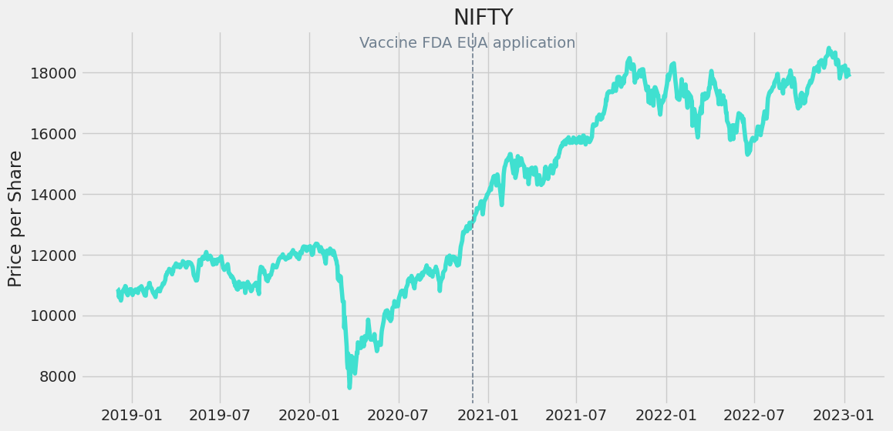
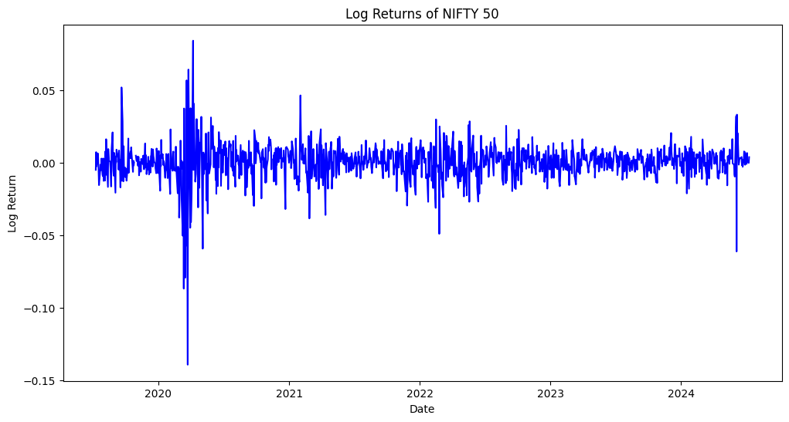
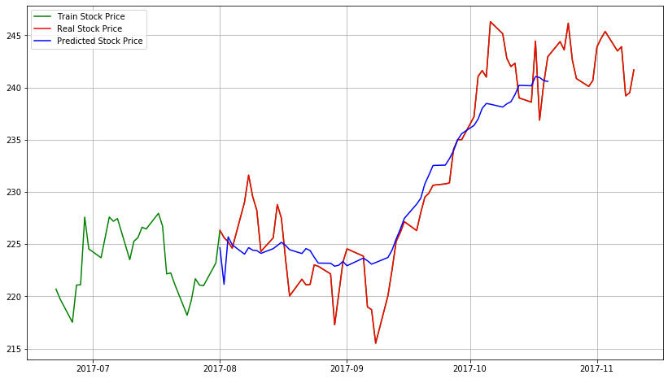
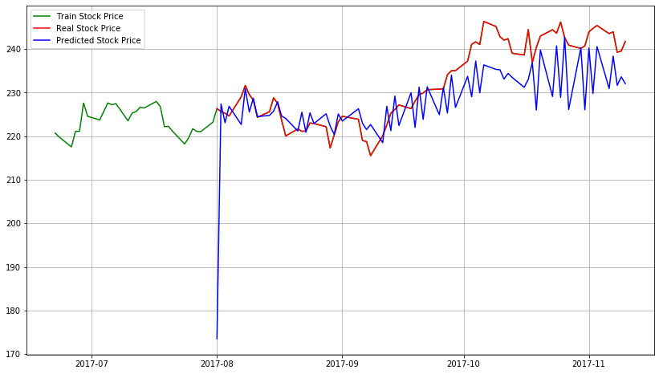
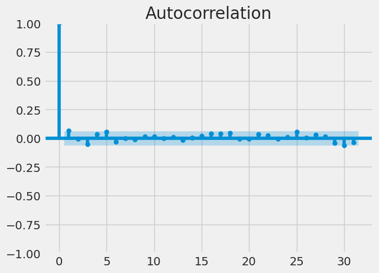
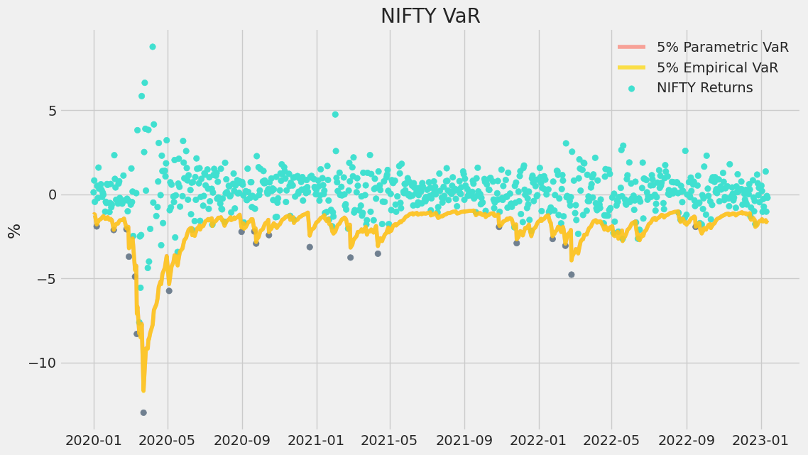
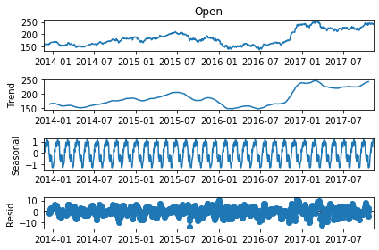
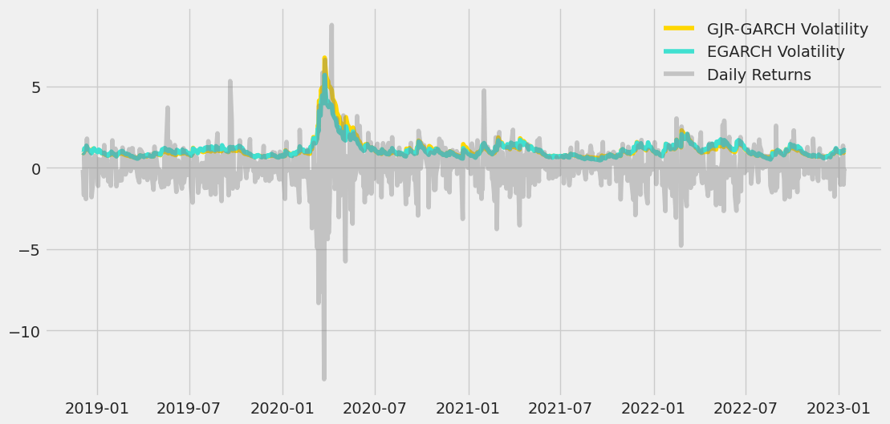
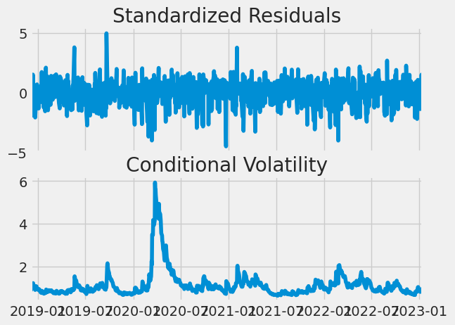

# Time-Series Analysis and Volatility Modeling of Nifty 50: An Application of ARCH and GARCH Models

This project involves analyzing and modeling the time series data of Nifty 50 using various methods including ARIMA, ARMA, and GARCH models. The goal is to forecast stock prices and their volatility, and to visualize different statistical properties and forecasting results.

## Project Structure

The project includes the following components:

### 1. Data Preparation
- ****: Visualization of Nifty 50 data over time.
- ****: Split of the data into training and testing sets.
- ****: Logarithmic returns of Nifty 50.

### 2. Rolling Statistics
- ****: Rolling mean and standard deviation to assess stationarity.

### 3. Model Fitting and Forecasting
- ****: Autoregressive (AR) model forecasting results.
- ****: Moving Average (MA) model forecasting results.
- ****: ARMA model forecasting results.
- **.png)**: ARIMA model (2,1,2) forecasting results.
- ****: Zoomed-in view of ARIMA model results.
- ****: Zoomed-in view of AR model results.
- ****: Zoomed-in view of MA model results.
- ****: Zoomed-in view of ARMA model results.

### 4. Model Diagnostics
- ****: Autocorrelation function (ACF) plot.
- ****: Variance of Nifty 50 data over time.
- ****: Seasonality in Nifty 50 data.

### 5. Volatility Modeling
- ****: Exponential GARCH model results.
- ****: GARCH model plot.

## Installation

To run the code in this project, ensure you have the following libraries installed:

```bash
pip install numpy pandas matplotlib statsmodels arch
